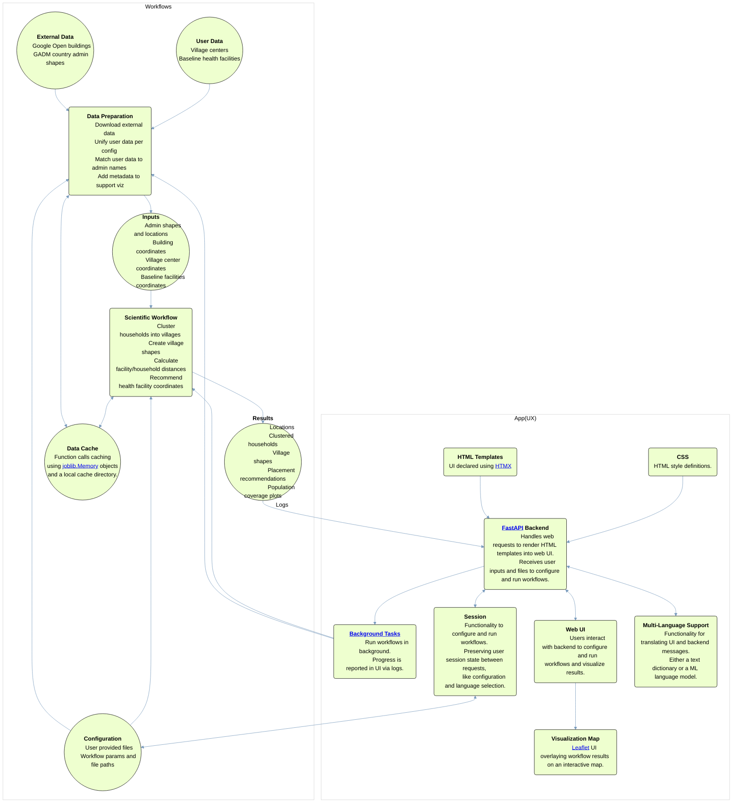

# Solution Components
This document provides a high-level overview of solution components.

## Table of Contents
* [Code Structure](#code-structure)
* [Components Diagram](#components-diagram)
* [Workflows](#workflows)
* [User Experience (UX)](#user-interface-ux)
* [Command Line Tool (CLI)](#command-line-tool)

## Code Structure

The code structure is organized into modules and packages. The main modules are:
- `deepfacility.flows`: Workflow classes which methods drive data preparation and scientific workflows.
- `deepfacility.data`: data preparation workflow steps.
- `deepfacility.tasks`: scientific workflow functionality.
- `deepfacility.viz`: visualization and interactive map features. 
- `deepfacility.config`: configuration classes.
- `deepfacility.utils`: utility functions.
- `deepfacility.lang`: language translation features.
- `deepfacility.ux`: demo web UI app.

## Components Diagram

Notes: 
- The diagram uses terms and abbreviations describes in the [Terminology](../README.md#terminology) section in the main README.
- For simplicity, the CLI part of the components is not included in the diagram.

---
## Workflows
The core library is responsible for implementing the data and scientific workflows and provide supporting functionality like configuration, multi-language support, data caching.

The processing workflows are driven from the [flows.py](../src/deepfacility/flows.py) module which is a great starting point for following the code flow:
- `prepare_inputs` - this function drives the data preparation workflow
- `process_locations` - this function drives the scientific workflow

These two functions are driving two main workflows:  
- [Data preparation](#data-preparation-workflow) workflow's code is in the [data](../src/deepfacility/data) directory:
  - [download.py](../src/deepfacility/data/downloads.py) - functions for downloading external data
  - [inputs.py](../src/deepfacility/data/inputs.py) - functions for preparing input files

- [Scientific workflow](#scientific-workflow) workflow's code is in the [tasks](../src/deepfacility/tasks) directory:
  - [clustering.py](../src/deepfacility/tasks/clustering.py) - functions for clustering households
  - [distance.py](../src/deepfacility/tasks/distance.py) - functions for calculating distances
  - [outlines.py](../src/deepfacility/tasks/outlines.py) - functions for creating village shapes
  - [placement.py](../src/deepfacility/tasks/placement.py) - functions for generating recommendations for health facilities locations

### Data Preparation Workflow
The data preparation workflow is responsible for preparing input data for the scientific workflow, which includes the following steps:
- Download Google Open Buildings for the specified country using [config/countries_s2_tokens.json](../src/deepfacility/config/countries_s2_tokens.json) file to determine the list of s2 geometry cells to download.   
- Download [GADM](https://gadm.org/download_country.html) shapes for the specified country.
- Clip Google Open Buildings to GADM country shapes and produce a households file containing admin names (from GADM shapes) and building coordinates.
- Standardize user provided village centers file by associating admin names from GADM shapes through a spatial join between center coordinates and admin shapes.
- Optionally, standardize user provided baseline health facilities file (in the same way as village centers) add enrich it with metadata to support visualizations.
  
In summary, the data preparation workflow ensures the scientific workflow receives standardized input files, 
consistent with the system config and GADM admin names.

### Scientific Workflow
The processing workflow receives the input files produced by the data preparation workflow and executes 
the scientific workflow to produce the recommended health facility coordinates and population coverage metrics.

Here is a high-level overview of the scientific workflow code structure:
- [flow.py](../src/deepfacility/flows.py) - contains top level workflow functions.
  - [tasks/clustering.py](../src/deepfacility/tasks/clustering.py) - contains functions for clustering households.
  - [tasks/outlines.py](../src/deepfacility/tasks/outlines.py) - contains functions for creating village shapes and merging results.
  - [tasks/placement.py](../src/deepfacility/tasks/placement.py) - contains functions for recommending health facility placements.

---

## User Interface (UX)

The UX implemented in the `deepfacility` package was designed for demo purposes. 
It provides a web-based interface for users to configure the tool, run the data preparation and scientific workflows and 
generate and explore visualizations.  

### UX Tech Stack

The technology stack used in this UX solution for the main web app scenarios includes [HTMX](https://htmx.org/) and [FastAPI](https://fastapi.tiangolo.com/) Python packages.  

The [HTMX](https://htmx.org/) package is used to provide a seamless user experience by updating parts of the page without a full page reload. 
This solution also removes JavaScript from the front-end HTML templates which simplifies the solution development. 
Still, under-the-hood when [HTMX templates](../src/deepfacility/ux/templates) are rendered they still contain JavaScript.  

On the backend side, [FastAPI](https://fastapi.tiangolo.com/) is used to provide a REST API for the web app in the [ux/main](../src/deepfacility/ux/main.py) module.  

The [session](../src/deepfacility/ux/session.py) module implements the session object which is: 
- Instantiated when the first request is processed. 
- Stored in the app state and is available to all requests.  
- Has a reference to a config which is used throughout the app for constructing file paths.

### Configuration UI
The app configuration allows users to upload the village centers and baseline health facilities (optional) files and 
select which columns contain coordinates and which represent village names.   

The backend then uses geopandas and pycountry packages to determine the country (and country code) based on the coordinates of the village centers.

After this, a config file is created in the session dir and its reference is stored in the session object.

Finally, the user is shown configuration parameters and a preview of the content of uploaded files. 
If all looks good, the user can proceed and kick off the data preparation workflow.

In case the app is stopped and the session object needs to be recreated, the app will look in the session directory for 
the latest saved config file and use it to recreate the session object. 

### Data Preparation UI
After the `Prepare Input Files` button is clicked, the data preparation workflow is started as a background process. 
UI uses the approach described in the [Monitoring Progress UI](design.md#monitoring-progress-ui) section to shows the progress in the form of 
stage completion and background task logs.  

The artifacts of the data preparation workflow are stored in the `inputs` dir and they include:
- locations csv file, containing a list of available admin locations 
- admin shapes geojson file, containing specified admin level shapes
- households csv file, containing country building coordinates and admin names  
- village centers csv file, containing standardized village centers data
- baseline facilities csv file, containing standardized baseline facilities data

### Scientific Workflow UI
After input files are ready a user can use the scientific workflow UI to select locations and run the scientific workflow.
The scientific workflow is started as a background process and the progress is reported in the UI.
This scientific workflow UI and backend work in the similar way as the data preparation UI and backend.

### Results Visualization UI
After the scientific workflow is completed, the visualization map is loaded automatically. 
The web visualization component is providing an interactive map of health facilities and villages, 
is implemented in html/javascript solution using the [Leaflet](https://leafletjs.com/) javascript library.
All the result files used for visualization are also available for download. 
The UI also offers ability to select and see visualizations of previous workflow runs.

---
## Command Line Tool
The command line interface (CLI) supports a set of commands which allow users to:
- see available countries and locations
- configure the tool
- run the data preparation workflow
- run the scientific workflow 
- generate web visualization map
- run the UX web app

In other words, CLI support all the functionality offers via UX.

