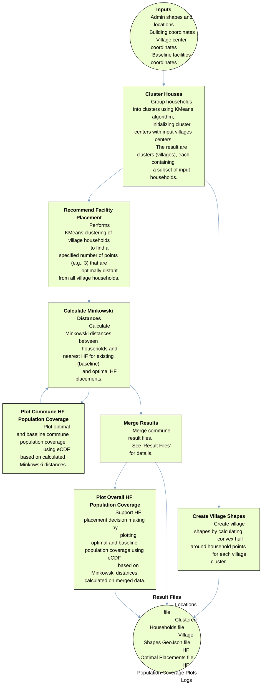

# Scientific Workflow Diagram
The below diagram illustrates the scientific workflow this tool performs. 

_Note: The diagram uses terms and abbreviations describes in the [Terminology](../README.md#terminology) section in the main README._

`Clustered Households` file contains:
  - cluster centers
  - cluster-household mapping
  - cluster-household counts statistics 
    - Descriptive statistics of cluster-household counts
    - % of small villages (with less than )
    - Total number of villages
